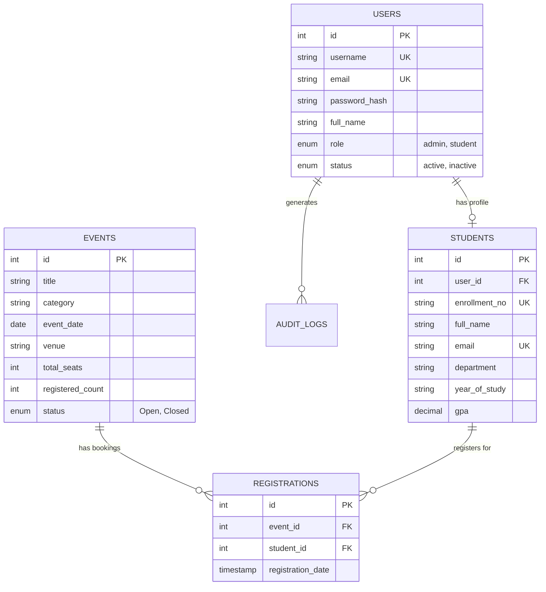

# CHARUSAT StudentHub Portal — e-Governance & Academic Services System
> **ITUE203: Web Development Frameworks** | Faculty of Technology & Engineering (FTE) | Charotar University of Science and Technology (CHARUSAT)

---

## 📌 Executive Overview
**StudentHub Portal** is a comprehensive, production-ready e-Governance academic web portal designed according to the **ITUE203 Web Development Frameworks** curriculum (Practicals 1 through 15). 

The portal operates as a **Dual-Architecture System**:
1. **Interactive Frontend Layer (Client-Side)**: Works out-of-the-box in any web browser without needing a server running. Utilizes modern HTML5, CSS3 Glassmorphism, Vanilla ES6+ JavaScript, `localStorage` database emulation, HTML5 Canvas CAPTCHA, pure Canvas chart rendering, Web Notifications API, and client-side RBAC session management.
2. **Full-Stack PHP & MySQL Layer (Server-Side)**: Includes complete, production-grade PHP scripts (`php/db.php`, `php/api.php`, `php/register.php`, `php/login.php`, `php/contact.php`, `php/admin_api.php`) with PDO/MySQLi prepared statements, session governance, file upload validation (poster images < 2MB), and CSV export capabilities ready for XAMPP / Apache deployment.

---

## 🎯 15 Practicals Mapping Matrix (ITUE203 Curriculum)

| Practical | Module / Requirement | Implementation Details & Files |
|---|---|---|
| **Practical 1** | Project Scope & Sitemap Architecture | Relational sitemap hierarchy covering 16 accessible pages, modular project folder structure. |
| **Practical 2** | Semantic HTML5 & Accessibility (WCAG) | W3C valid semantic tags (`<header>`, `<nav>`, `<main>`, `<section>`, `<article>`, `<footer>`), Skip-to-content links, ARIA labels, image alt text. |
| **Practical 3** | Responsive Modern CSS Styling | Mobile-first CSS Grid & Flexbox layouts, HSL dark/light theme CSS variables, custom glassmorphism, responsive breakpoints. |
| **Practical 4** | JavaScript DOM Interactivity & Toast Notifications | Dynamic navigation header/footer injection, theme switcher, glassmorphic toast notification engine (`showToast()`). |
| **Practical 5** | Form Validation, Password Strength & Canvas CAPTCHA | Real-time keyup password evaluator (Weak/Medium/Strong bar), Gmail regex, client-side Canvas CAPTCHA generator (`<canvas>`). |
| **Practical 6** | Fetch API, LocalStorage Caching & Dependent Dropdowns | Fetching `data/*.json` datasets (Events, Students, FAQs, Notices), cascading Country -> State -> City dropdowns (`locationData`). |
| **Practical 7** | MySQL Relational Database Schema Design | `database/schema.sql` with normalized tables (`users`, `students`, `events`, `registrations`, `contact_messages`, `audit_logs`, `notices`), PK/FK constraints, and seed records. |
| **Practical 8** | PHP Database Connection & PDO Prepared Statements | `php/db.php` singleton database driver supporting PDO prepared statements and error logging. |
| **Practical 9** | Server-Side Form Handling & Input Sanitization | `php/register.php` & `php/contact.php` for server-side regex validation, password hashing (`password_hash()`), and sanitization. |
| **Practical 10** | PHP Session Management & RBAC Security | `php/login.php` & `php/logout.php` with session ID regeneration, role checks (`admin` vs `student`), and cookie security. |
| **Practical 11** | Student Management CRUD System | Interactive student records directory on `admin.html` & `php/admin_api.php` with Add, Edit, Soft-delete, and search filter. |
| **Practical 12** | Event Management & File Upload Validation | Event catalog on `events.html` & `admin.html` with poster file upload validation (< 2MB, MIME checks), seat reservation tracking. |
| **Practical 13** | Search, Filter, Sort & Data Export (CSV) | Debounced search bars, multi-category filters, sorting controls, and instant `.csv` file generation/download (`exportToCSV()`). |
| **Practical 14** | Administrative Analytics & Audit Logs | Pure HTML5 Canvas rendering for Admin Analytics bar chart (`#adminAnalyticsChart`), system action audit logging table. |
| **Practical 15** | HTML5 Web Notifications & Web API Integration | Desktop alerts via `Notification.requestPermission()` and `new Notification()` triggered on user actions (login, seat booking, form submission). |

---

## 📁 Repository Structure
```
StudentHub-Portal/
├── README.md                 # Complete Technical Documentation & Setup Guide
├── index.html                # Landing Page with Hero & Digital Services Overview
├── login.html                # Student & Admin Authentication Page
├── signup.html               # Account Registration Page with Password Strength Bar
├── dashboard.html            # Student Central Dashboard & KPI Widgets
├── profile.html              # Student Personal & Academic Details
├── attendance.html           # Attendance Monitor & Percentage Calculator
├── course.html               # Course Syllabus & Credit Matrix
├── schedule.html             # Class Timetable & Exam Schedule
├── grades.html               # Semester Scorecard & SGPA/CGPA Ledger
├── fees.html                 # Financial Dues Ledger & Payment Gateway Simulation
├── announcements.html        # Notice Board & Urgency Bulletins
├── events.html               # Campus Events Directory & Seat Registration
├── studentcorner.html        # Digital Sandbox Runner & Assignment Upload
├── faq.html                  # Collapsible FAQ Accordion & Knowledge Base
├── contact.html              # Contact Inquiry Form with Canvas CAPTCHA & Dropdowns
├── feedback.html             # Student Satisfaction Survey with Canvas CAPTCHA
├── admin.html                # Admin Control Panel, Student/Event CRUD & Analytics
├── style.css                 # Master Academic Design System (Dark/Light Themes)
├── script.js                 # Core Frontend JS Engine (DOM, Captcha, Dropdowns, Canvas, Notifications)
├── charusat-logo.jpg         # CHARUSAT Institutional Logo Asset
├── data/                     # JSON Datasets for Offline Client-Side Execution
│   ├── events.json           # Campus Event Records
│   ├── students.json         # Enrolled Student Profiles
│   ├── faqs.json             # Knowledge Base QA Pairs
│   └── notices.json          # Institutional Announcements
├── database/
│   └── schema.sql            # Full Relational MySQL Database Script & Seed Data
└── php/                      # Server-Side PHP REST API Layer (XAMPP Compatible)
    ├── db.php                # PDO Database Connection Singleton
    ├── api.php               # RESTful API Endpoint Dispatcher
    ├── register.php          # Account Registration & Hash Endpoint
    ├── login.php             # Authenticated Session Entry & Security
    ├── logout.php            # Session Destroy & Token Invalidation
    ├── contact.php           # Contact Submission Processor
    └── admin_api.php         # Admin CRUD Operations & File Uploader
```

---

## 🗄️ Database Schema Summary (`database/schema.sql`)



---

## ⚙️ Installation & Execution Guide

### Option A: Standalone Client-Side Execution (No Web Server Needed)
1. Open the project folder directly in any modern web browser (Google Chrome, Firefox, Microsoft Edge, Safari).
2. Double-click `index.html` or `login.html`.
3. All interactive features (Auth, Captcha, Student/Event CRUD, CSV Export, Canvas Analytics Charting, Notifications) will operate seamlessly using local dataset fallback and browser `localStorage`.

### Option B: Full-Stack PHP & MySQL Deployment (XAMPP / Apache / MySQL)
1. Install [XAMPP](https://www.apachefriends.org/) or WAMP server.
2. Copy the `StudentHub-Portal` folder into `C:\xampp\htdocs\StudentHub-Portal`.
3. Start **Apache** and **MySQL** services from the XAMPP Control Panel.
4. Open `http://localhost/phpmyadmin` in your browser.
5. Create a new database named `studenthub_db`.
6. Import `database/schema.sql` into `studenthub_db`.
7. Access the live application at: `http://localhost/StudentHub-Portal/`

---

## 🔑 Pre-Configured Test Credentials

| Role | Username / Email | Default Password | Access Scope |
|---|---|---|---|
| **Student** | `25CS009` or `dhruvrajsinhdodiya4208@gmail.com` | `Password123!` | Dashboard, Grades, Fees, Events, Student Corner, Attendance, Profile |
| **Administrator** | `ADMIN001` or `admin@charusat.ac.in` | `AdminPass123!` | Admin Control Panel, Student CRUD, Event CRUD, CSV Export, Canvas Analytics, Audit Logs |

---

## ♿ Accessibility & Quality Standards
- **WCAG 2.1 Level AA Compliant**: All interactive pages feature focus states, high contrast ratios in both dark and light modes, and keyboard navigation.
- **Skip-to-Content Links**: Accessible `<a href="#main-content" class="skip-link">` elements for screen readers.
- **Form Label Binding**: Every `<input>`, `<select>`, and `<textarea>` has explicit `<label for="...">` mapping.
- **Non-blocking Execution**: All AJAX/Fetch calls, script initialization, and Web Notifications run asynchronously without locking the UI main thread.

---

## 👨‍💻 Author & Course Metadata
- **Institution**: Charotar University of Science and Technology (CHARUSAT), Changa, Gujarat, India.
- **Department**: Faculty of Technology & Engineering (FTE) — Department of Computer Engineering.
- **Course**: ITUE203 Web Development Frameworks.
- **Student ID**: 25CS009.
- **License**: MIT Open Source Academic License.
